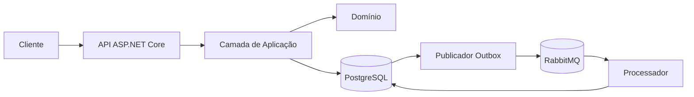

# API de Documentos Fiscais - Desafio Técnico SIEG

API REST em .NET 8 para receber, validar, persistir e consultar documentos fiscais XML dos
tipos NFe, CTe e NFSe. Cada criação ou atualização gera um evento transacional, publicado no
RabbitMQ por meio do padrão Outbox. Um processador independente consome o evento e mantém um
resumo do documento de forma idempotente.

## Funcionalidades

- ingestão de NFe, CTe e NFSe por `multipart/form-data`;
- armazenamento do XML normalizado e dos dados usados nas consultas;
- listagem paginada com filtros por tipo, CNPJ, UF e período de emissão;
- consulta, atualização e exclusão de documentos;
- publicação confiável de eventos com Outbox;
- consumidor RabbitMQ com retentativas, fila de falhas e idempotência;
- Swagger, tratamento global de erros e limitação de requisições de ingestão;
- testes unitários, de arquitetura e de integração com PostgreSQL e RabbitMQ reais em contêineres.

## Arquitetura



A solução segue uma separação inspirada em Clean Architecture:

```text
src/
├── Sieg.DocumentosFiscais.Dominio          Entidades, enumerações e eventos
├── Sieg.DocumentosFiscais.Aplicacao        Casos de uso, DTOs e contratos
├── Sieg.DocumentosFiscais.Infraestrutura   PostgreSQL, XML e RabbitMQ
├── Sieg.DocumentosFiscais.Api              Endpoints REST e tratamento HTTP
└── Sieg.DocumentosFiscais.Processador      Consumidor executado em segundo plano
tests/
├── Sieg.DocumentosFiscais.Testes.Unitarios
├── Sieg.DocumentosFiscais.Testes.Integracao
└── Sieg.DocumentosFiscais.Testes.Arquitetura
```

O domínio não depende de infraestrutura. A aplicação coordena os casos de uso por interfaces,
e a infraestrutura implementa persistência, análise dos XMLs e mensageria. A API publica o
Outbox, enquanto o processador é responsável pelo consumo e pela geração dos resumos.

### Por que utilizar Clean Architecture

A Clean Architecture foi adotada para manter as regras de documentos fiscais independentes dos
detalhes técnicos usados para executá-las. Entidades, enumerações e eventos do domínio não
conhecem ASP.NET Core, Entity Framework Core, PostgreSQL ou RabbitMQ. A camada de aplicação
define os casos de uso e os contratos necessários, enquanto a infraestrutura fornece suas
implementações. Dessa forma, as dependências apontam para as regras centrais da solução, e não
para ferramentas externas.

Essa separação traz benefícios importantes para este projeto:

- permite testar regras e casos de uso sem iniciar banco de dados, servidor HTTP ou mensageria;
- impede que controllers concentrem regras de negócio ou acessem diretamente o contexto do EF
  Core;
- permite substituir PostgreSQL, RabbitMQ ou o processador de XML com menor impacto nas regras
  da aplicação;
- possibilita que a API e o processador em segundo plano reutilizem os mesmos contratos e casos
  de uso;
- torna explícitos os limites entre domínio, aplicação, infraestrutura e mecanismos de entrada;
- reduz o acoplamento e facilita a evolução independente de persistência, XML e mensageria.

O custo dessa abordagem é a existência de mais projetos, interfaces e configurações de injeção
de dependência. Neste desafio, esse custo é compensado pela presença de persistência
transacional, processamento de diferentes XMLs, publicação Outbox, consumo assíncrono e testes
em vários níveis. Os testes de arquitetura garantem automaticamente que esses limites não sejam
violados durante a evolução da solução.

#### Trade-offs da escolha

| Decisão | Ganho | Custo ou limitação |
|---|---|---|
| Separar a solução em camadas | Responsabilidades e dependências ficam explícitas | Mais projetos, pastas e arquivos para manter |
| Definir contratos na aplicação | Casos de uso podem ser testados e a infraestrutura pode ser substituída | Exige interfaces, implementações e registros na injeção de dependência |
| Manter o domínio independente | Regras de negócio não ficam acopladas a frameworks | Requer mapeamentos entre entidades, DTOs, eventos e modelos de persistência |
| Isolar EF Core e RabbitMQ na infraestrutura | API e aplicação não conhecem detalhes externos | A navegação pelo código envolve atravessar mais camadas |
| Aplicar regras arquiteturais automaticamente | Regressões de dependência são detectadas no build | A suíte de arquitetura também precisa evoluir quando surgem novas convenções |

Em uma API CRUD pequena e sem perspectiva de evolução, essa estrutura poderia representar
complexidade desnecessária. Neste caso, porém, a combinação de persistência transacional,
idempotência, Outbox, processamento assíncrono, retentativas e múltiplos formatos fiscais torna
vantajosa a separação. O trade-off assumido é aceitar mais estrutura e código de integração em
troca de testabilidade, menor acoplamento e maior segurança para evoluir a solução.

## Tecnologias utilizadas

- .NET 8 e C#;
- ASP.NET Core Web API;
- Entity Framework Core 8 e Npgsql;
- PostgreSQL 16;
- RabbitMQ 4 com `RabbitMQ.Client`;
- Swagger/OpenAPI com Swashbuckle;
- NUnit e NSubstitute;
- `WebApplicationFactory` e Testcontainers para testes de integração;
- Docker e Docker Compose.

O SDK definido em `global.json` é o .NET SDK `8.0.407`. O projeto trata avisos de compilação
como erros e utiliza o nível recomendado mais recente dos analisadores.

## Início rápido com Docker

### Pré-requisitos

- Docker Desktop ou Docker Engine com Docker Compose;
- portas `5119`, `5432`, `5672` e `15672` disponíveis.

Opcionalmente, copie o arquivo de exemplo e altere as credenciais locais:

```powershell
Copy-Item .env.example .env
```

Construa as imagens e inicie PostgreSQL, RabbitMQ, API e processador:

```powershell
docker compose up --build -d
docker compose ps
```

O Compose aguarda PostgreSQL e RabbitMQ ficarem saudáveis. Em seguida, inicia a API, aplica as
migrations pendentes e somente libera o processador depois que a API estiver saudável.

Para acompanhar os logs:

```powershell
docker compose logs -f api processador
```

Para encerrar sem remover os volumes:

```powershell
docker compose down
```

Para também apagar os dados locais, use `docker compose down -v`. Esse comando remove os
volumes do PostgreSQL e RabbitMQ e, portanto, deve ser usado somente quando os dados puderem
ser descartados.

## Iniciar somente PostgreSQL e RabbitMQ

Para executar a API e o processador diretamente pelo SDK:

```powershell
docker compose up -d postgres rabbitmq
```

Sem um arquivo `.env`, as credenciais locais padrão são:

| Serviço | Usuário | Senha |
|---|---|---|
| PostgreSQL | `postgres` | `postgres` |
| RabbitMQ | `sieg` | `sieg` |

Esses valores existem apenas para desenvolvimento. Em outros ambientes, use variáveis de
ambiente ou um gerenciador de segredos. Consulte [CONFIGURACAO.md](CONFIGURACAO.md) para a
lista de configurações.

## Migrations

No Compose, a API aplica automaticamente as migrations porque a variável
`BancoDados__AplicarMigracoesAoIniciar` está habilitada.

Para aplicar manualmente com o banco local em execução, restaure a ferramenta versionada no
repositório:

```powershell
dotnet tool restore
```

Depois execute:

```powershell
dotnet ef database update `
  --project src/Sieg.DocumentosFiscais.Infraestrutura/Sieg.DocumentosFiscais.Infraestrutura.csproj `
  --startup-project src/Sieg.DocumentosFiscais.Infraestrutura/Sieg.DocumentosFiscais.Infraestrutura.csproj `
  --context DocumentosFiscaisDbContext
```

A fábrica de design respeita a variável `ConnectionStrings__PostgreSql` e utiliza a conexão
local padrão apenas quando ela não estiver definida. Em produção, recomenda-se aplicar as
migrations em uma etapa exclusiva do processo de implantação, antes de escalar a API.

## Executar sem containerizar a aplicação

Com PostgreSQL e RabbitMQ iniciados e as migrations aplicadas, execute em terminais separados.

API:

```powershell
$env:ASPNETCORE_ENVIRONMENT = "Development"
dotnet run --project src/Sieg.DocumentosFiscais.Api --launch-profile http
```

Processador:

```powershell
$env:DOTNET_ENVIRONMENT = "Development"
dotnet run --project src/Sieg.DocumentosFiscais.Processador
```

Se as credenciais locais tiverem sido alteradas, defina também
`ConnectionStrings__PostgreSql`, `RabbitMq__Servidor`, `RabbitMq__Porta`,
`RabbitMq__Usuario` e `RabbitMq__Senha` nos dois processos.

## URLs locais

| Recurso | URL |
|---|---|
| Swagger | <http://localhost:5119/swagger> |
| Saúde da API | <http://localhost:5119/saude> |
| Painel do RabbitMQ | <http://localhost:15672> |

O Swagger é habilitado no ambiente `Development`. O usuário e a senha do painel do RabbitMQ
são os valores configurados em `RABBITMQ_DEFAULT_USER` e `RABBITMQ_DEFAULT_PASS`.

## Endpoints

| Método | Rota | Descrição |
|---|---|---|
| `POST` | `/api/v1/documentos-fiscais` | Processa um arquivo XML |
| `GET` | `/api/v1/documentos-fiscais` | Lista documentos com filtros e paginação |
| `GET` | `/api/v1/documentos-fiscais/{id}` | Consulta os detalhes protegidos |
| `PUT` | `/api/v1/documentos-fiscais/{id}` | Atualiza usando um novo XML |
| `DELETE` | `/api/v1/documentos-fiscais/{id}` | Exclui o documento |

Os endpoints de criação e atualização recebem o campo `arquivo` como
`multipart/form-data`. O limite do XML é 5 MB. A ingestão possui limite de 30 requisições por
minuto por instância da API.

Filtros aceitos na listagem:

- `tipo`: `NFe`, `CTe` ou `NFSe`;
- `cnpj`: numérico ou alfanumérico, com ou sem pontuação;
- `unidadeFederativa`: duas letras;
- `dataEmissaoInicial` e `dataEmissaoFinal`: data e hora ISO 8601;
- `pagina`: começa em 1;
- `tamanhoPagina`: entre 1 e 100.

## Exemplos de requisições

O diretório [`exemplos`](exemplos) contém arquivos de NFe, CTe e NFSe prontos para uso.

### Criar uma NFe

```powershell
curl.exe -i -X POST "http://localhost:5119/api/v1/documentos-fiscais" `
  -F "arquivo=@exemplos/nfe.xml;type=application/xml"
```

A primeira ingestão retorna `201 Created`. O XML bruto não faz parte da resposta:

```json
{
  "id": "00000000-0000-0000-0000-000000000000",
  "tipo": "NFe",
  "chaveFiscal": "35261012**********95550010000000011000000010",
  "cnpjEmitente": "12.***.***/0001-**",
  "cnpjDestinatario": "98.***.***/0001-**",
  "unidadeFederativa": "SP",
  "dataEmissao": "2026-10-01T09:00:00-03:00",
  "hashConteudo": "SHA256_DO_XML_NORMALIZADO",
  "criadoEm": "2026-10-02T12:00:00+00:00",
  "atualizadoEm": "2026-10-02T12:00:00+00:00"
}
```

Reenviar exatamente o mesmo XML retorna `200 OK`, o mesmo identificador e o cabeçalho
`Idempotent-Replay: true`.

### Criar outros tipos

```powershell
curl.exe -X POST "http://localhost:5119/api/v1/documentos-fiscais" `
  -F "arquivo=@exemplos/cte.xml;type=application/xml"

curl.exe -X POST "http://localhost:5119/api/v1/documentos-fiscais" `
  -F "arquivo=@exemplos/nfse.xml;type=application/xml"
```

O exemplo de NFSe utiliza um CNPJ alfanumérico para demonstrar o formato previsto para o novo
padrão de CNPJ.

### Listar com filtros e paginação

```powershell
curl.exe "http://localhost:5119/api/v1/documentos-fiscais?tipo=NFe&cnpj=12.345.678%2F0001-95&unidadeFederativa=SP&pagina=1&tamanhoPagina=20"
```

### Consultar por identificador

```powershell
$id = "SUBSTITUA-PELO-ID-RETORNADO"
curl.exe "http://localhost:5119/api/v1/documentos-fiscais/$id"
```

### Atualizar com um CTe

```powershell
$id = "SUBSTITUA-PELO-ID-RETORNADO"
curl.exe -X PUT "http://localhost:5119/api/v1/documentos-fiscais/$id" `
  -F "arquivo=@exemplos/cte.xml;type=application/xml"
```

### Excluir

```powershell
$id = "SUBSTITUA-PELO-ID-RETORNADO"
curl.exe -i -X DELETE "http://localhost:5119/api/v1/documentos-fiscais/$id"
```

## Decisão pelo PostgreSQL

Foi escolhido PostgreSQL porque os dados extraídos dos documentos possuem estrutura estável e
relacionamentos claros, enquanto os requisitos pedem filtros, paginação, unicidade e operações
transacionais. A escolha permite:

- gravar o documento e seu evento Outbox na mesma transação;
- garantir idempotência por índices únicos de hash e de tipo/chave fiscal;
- indexar CNPJ, UF e data de emissão para as consultas;
- controlar concorrência otimista por meio da coluna de sistema `xmin`;
- manter o XML integral em `text` e o evento Outbox em `jsonb`;
- usar migrations versionadas pelo Entity Framework Core.

MongoDB seria viável para XMLs muito heterogêneos e consultas centradas no documento completo,
mas traria menos benefício neste caso, pois os campos consultáveis são conhecidos e a
consistência transacional entre documento e Outbox é central para a solução.

## Outbox e idempotência

Ao criar ou atualizar um documento, a aplicação persiste o documento e um `EventoPendente` na
mesma transação do PostgreSQL. Somente após o commit, o serviço Outbox busca eventos pendentes,
publica no RabbitMQ com mensagem persistente e confirmação do broker e marca o evento como
publicado.

Se o RabbitMQ estiver indisponível, o evento continua no banco. A publicação é reagendada com
backoff exponencial, começando em 5 segundos e limitando o crescimento do expoente. O lote
padrão contém até 20 eventos.

A idempotência ocorre em dois pontos:

1. **Ingestão:** o XML normalizado recebe um SHA-256. Um índice único impede que o mesmo
   conteúdo seja gravado duas vezes. Tipo e chave fiscal também possuem restrição única.
2. **Consumo:** cada evento processado é registrado com a chave composta por `IdEvento` e nome
   do consumidor. Uma entrega repetida é confirmada sem gerar outro resumo.

Essa abordagem oferece entrega efetiva *at least once* com efeito de negócio idempotente. Há
uma pequena janela de consistência eventual entre a resposta da API e a geração do resumo.

## Filas, exchanges e retentativas

Configuração padrão fora do Compose:

| Papel | Nome | Tipo ou comportamento |
|---|---|---|
| Exchange principal | `documentos-fiscais` | `topic`, durável |
| Fila principal | `documentos-fiscais-processados` | durável |
| Routing key | `documento-fiscal.processado` | evento processado |
| Exchange de retentativa | `documentos-fiscais-retentativas` | `direct`, durável |
| Filas de retentativa | `documentos-fiscais-processados.retentativa.1..3` | TTL e dead-letter para a fila principal |
| Exchange de falhas | `documentos-fiscais-falhas` | `direct`, durável |
| Fila de falhas | `documentos-fiscais-processados-falhas` | mensagens esgotadas |
| Routing key de falha | `documento-fiscal.processado.falha` | falha definitiva |

O consumidor tenta processar imediatamente e depois aplica atrasos de 5, 30 e 120 segundos.
Cada fila de retentativa possui TTL e devolve a mensagem ao exchange principal por dead-letter.
O cabeçalho `x-tentativa` acompanha a contagem. Após a terceira retentativa, a mensagem segue
para a fila de falhas com o tipo do último erro, sem detalhes potencialmente sensíveis.

Para coexistir com execuções locais anteriores, o Compose usa a mesma estrutura com o sufixo
`-compose` nos nomes principais.

## Segurança e dados sensíveis

- o XML é lido com DTD proibido, `XmlResolver` desabilitado, limite de 5 MB e profundidade
  máxima de 64 níveis, reduzindo riscos de XXE e expansão de entidades;
- o XML bruto é persistido para rastreabilidade, mas não é exposto nos DTOs da API;
- CNPJs numéricos e alfanuméricos são mascarados nas respostas;
- o trecho que contém o CNPJ também é ocultado nas chaves fiscais de 44 caracteres;
- mensagens HTTP são controladas e não repetem conteúdo recebido;
- logs e metadados de falha registram identificadores técnicos e tipos de erro, não o XML nem
  mensagens de exceção que possam conter dados;
- credenciais de ambientes não locais são fornecidas por variáveis de ambiente;
- `.env` está ignorado pelo Git e `.env.example` contém somente exemplos;
- os endpoints de ingestão possuem limite de tamanho e rate limiting.

Os XMLs ainda são armazenados sem criptografia em nível de aplicação. Em produção, devem ser
complementados por criptografia de disco/banco, controle de acesso, gestão de chaves, política de
retenção e auditoria conforme a classificação dos dados e os requisitos da LGPD.

## Executar os testes

Restaure e compile a solução:

```powershell
dotnet restore Sieg.DocumentosFiscais.sln
dotnet build Sieg.DocumentosFiscais.sln --configuration Release --no-restore
```

Somente testes unitários, sem dependência de Docker:

```powershell
dotnet test tests/Sieg.DocumentosFiscais.Testes.Unitarios `
  --configuration Release --no-build
```

Testes de arquitetura, também sem dependência de Docker:

```powershell
dotnet test tests/Sieg.DocumentosFiscais.Testes.Arquitetura `
  --configuration Release --no-build
```

Eles impedem dependências invertidas entre as camadas, acesso direto da API ao contexto do EF
Core, contratos da aplicação sem implementação na infraestrutura e violações das convenções de
nomenclatura adotadas no projeto.

Toda a suíte:

```powershell
dotnet test Sieg.DocumentosFiscais.sln --configuration Release --no-build
```

Os testes de integração utilizam Testcontainers e precisam do Docker em execução. Eles criam
PostgreSQL e RabbitMQ descartáveis, validando a API, persistência, migrations, Outbox,
idempotência, retentativas e fila de falhas.

## Testes de carga com k6

A suíte em [`tests/carga`](tests/carga) executa simultaneamente quatro cenários:

- upload concorrente, criando uma chave fiscal exclusiva por iteração;
- reenvio concorrente do mesmo XML, validando a idempotência;
- listagem paginada, alternando entre as cinco primeiras páginas;
- consulta repetida de um documento pelo identificador.

Antes do teste, ele cria automaticamente o documento usado nos cenários de reenvio e consulta.
Para que a medição não seja limitada intencionalmente pelas 30 ingestões por minuto da
configuração normal, inicie a API com um limite específico para carga:

```powershell
$env:LIMITE_INGESTAO_POR_MINUTO = "10000"
docker compose up --build -d postgres rabbitmq api processador
docker compose --profile carga run --rm k6
Remove-Item Env:LIMITE_INGESTAO_POR_MINUTO
```

O teste falha quando a taxa de erros de qualquer cenário chega a 1%. Os limites padrão de
latência no percentil 95 são 2 segundos para upload, 1 segundo para reenvio e 500 milissegundos
para as duas consultas. Ao final são gerados `tests/carga/resultados/resumo.json` e
`tests/carga/resultados/relatorio.html`; ambos ficam ignorados pelo Git.

Cada usuário virtual de escrita aguarda 200 milissegundos entre iterações. Isso mantém a carga
controlada e evita que um teste local curto produza tráfego acidentalmente ilimitado.

Volume, duração, taxas e limites de latência podem ser alterados pelas variáveis documentadas
em [`.env.example`](.env.example). Execute cargas apenas em um ambiente controlado, nunca
diretamente em produção.

## Limitações e possíveis melhorias

- adicionar autenticação e autorização por escopos ou perfis;
- validar os documentos por XSD, regras fiscais e assinatura digital;
- criptografar o XML em repouso e definir política de retenção e descarte;
- mover XMLs grandes para object storage, mantendo metadados e referência no PostgreSQL;
- adicionar métricas, tracing distribuído, dashboards e alertas para Outbox e filas;
- usar um rate limiter distribuído quando houver várias instâncias da API;
- executar migrations por um job exclusivo no processo de implantação;
- criar endpoint ou ferramenta administrativa para inspeção e reprocessamento da fila de falhas;
- estabelecer uma linha de base de desempenho em ambiente equivalente ao de produção;
- ampliar o consumidor com novos handlers e versionamento explícito dos contratos de eventos;
- definir políticas de backup, recuperação e alta disponibilidade para PostgreSQL e RabbitMQ.
